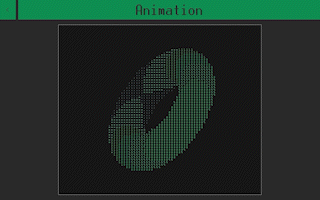
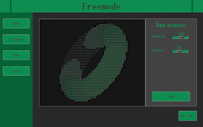
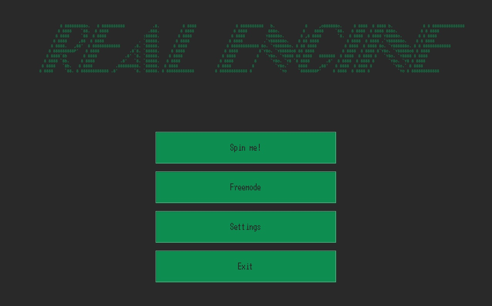
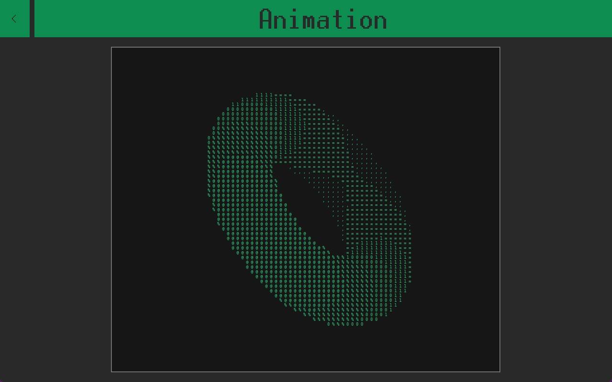
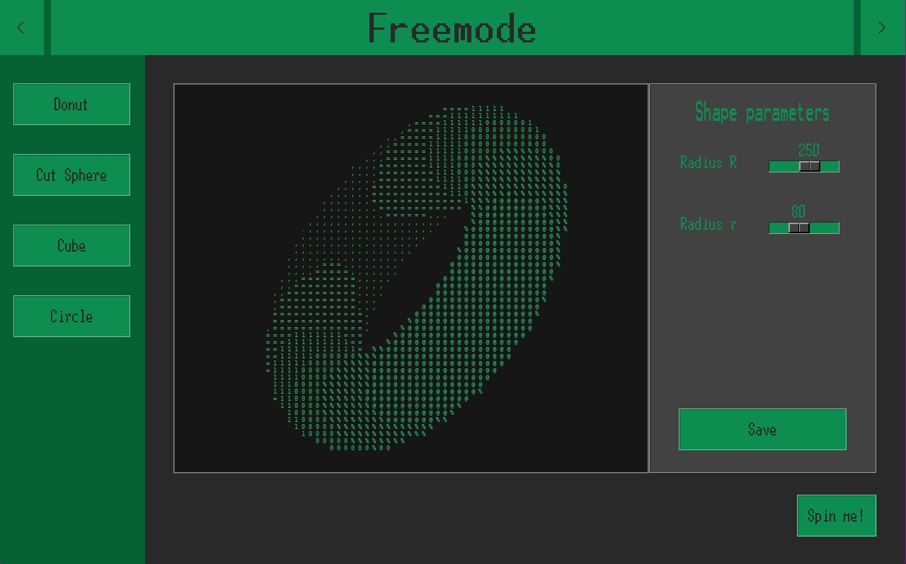
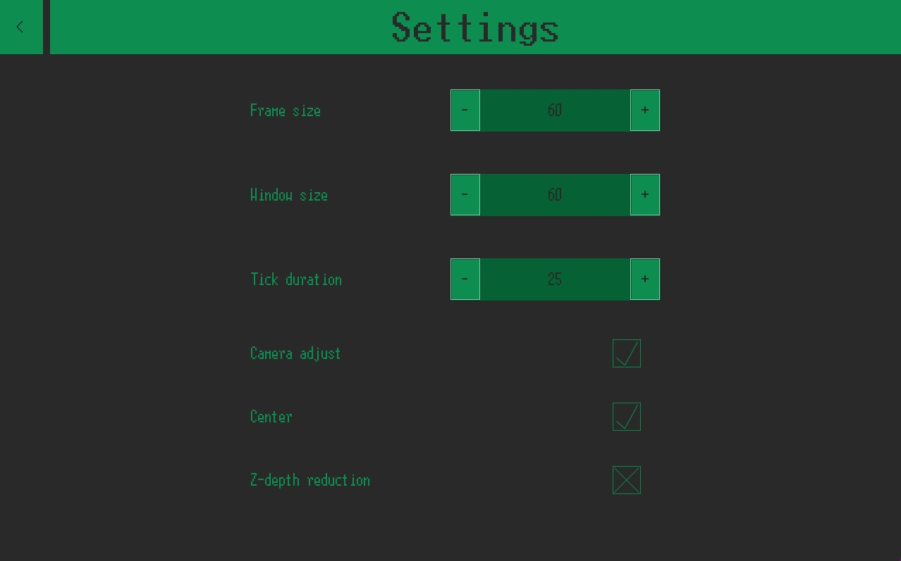

# About this project
***Real Engine*** is a 3D Engine written fully in Python (v. 3.11.0). The premise of the project was inspired by [Andy Sloane's work](https://www.a1k0n.net/2011/07/20/donut-math.html), to most known as the *Spinning Donut in C*. I took a more ambitious route to write an ***entire graphical engine that could render any given 'image' in ASCII***. The project made out of two major instances:
  - [Engine](#engine-overview) - the fundament and entire back-end of the project - consists of three main classes: *Camera*, *Renderer*, *Shape*. It's responsible for creating mathematical models of objects, processing them into appropriate 2D projection with simulated depth and then formatting the obtained image so that it can be displayed in a terminal.
  - [GUI](#gui-overview) - the front-end of the whole operation. Let's user generate and specify shapes to animate and change engine settings.

## Brief presentation
Here is how the Real Engine looks in action


You can observe how the object seems to come closer and further, it's a result of camera settings that you can read about in the [**engine overview**](#engine-overview) section.


To give a taste of what other functionalities hide inside the engine you can see the freemode menu in use

But because all of the fun lays in using the app yourself I encourage you to visit [requirements](#requirements) and try it out!

## Future developement
Major ideas for improvement:
  - rewritting engine so that it operates on 4D matrixes - probably more optimal (easier transformations) and they leave room for the use of quaternions as the method of rotation
  - adding means of impacting the parameters of animation
  - adding option for creating custom shapes
  
Minor ideas for improvement:
  - making custom frame inherting from `tk.Frame` with inbuilt resize function
  - optimizing shape creation

---
# Requirements
To run the software smoothly first you need **Python** at version higher than ***3.9.14***. All the needed libraries are: Tkinter, Numpy, Math and PIL. To install them on Windows run:
```
pip install tk
pip install numpy
pip install pillow
```
## Taking Real Engine for a spin
After you have your packages ready, all you need to do is copy my respository and run `main.py`:
```
py main.py
```
***Have fun!***

---
# Engine overview
  **Shape** is a parent class responsible for generating objects suitable for both Camera and Renderer. 
  

## Camera
  **Camera** translates WCS (World Coordinate System) into its own, granting rotation and translation without the need of finding reverse transformation matrixes when there is need of going back to "square one". It performs the *projection*, *processing* and *rasterization*. 
### Camera's functionalities

**Projection** is crucial for rendering images as the objects are three dimensional in their nature, meaning that they have one redundant dimension that can't be displayed on 2D screen. In this project the XY plane is chosen as the projection plane. There are two implemented ways of projction:
  - by z-depth reduction - simulating real-life perspective behaviour. The further the object from the viewer, the smaller it looks. The implementation in the engine incorporates this by scaling X and Y coordinates by dividing them by OZ value. Eventhough it seems more realistic, it doesn't yearn satisfying results because of the small capacity of 'pixels' (characters) in the terminal.
  - by XY projection - simply taking XY coordinates as they are
  
**Processing** is responsible for adjusting view - sometimes it's hard to predict how the object is going to behave during rotation or translation, so those implementations make some of the camera work's aspects automatic:
  - center - changing the view so that the object is placed equally far from frame borders
  - adjust - moves the camera in OZ so that the whole object is visible (in front of the camera)
  
  **Rasterization** is a process of rescalling/translating camera view so that every point of objects CS has their display CS counterpart. 

## Renderer
  **Renderer** takes the image generated by camera, maps it into ASCII characters and formats the string so that it can be displayed. Mapping is done by dividing points (by their OZ coordinate) into 7 buckets, so that each (X,Y) point has their own coresponding ASCII character that represents the level of closeness to the camera
  
---
# GUI overview
The main building blocks of GUI are ***frames*** which act as containters for functionalities (buttons, sliders etc) called ***widgets***. The visual layer or rather its definition is kept in `styles.py`. The `GUI` class manages frames' behaviour and communicates with engine. Designs of the main frames:

### Main menu frame

The title banner was generated using [ASCII art generator](https://patorjk.com/software/taag/#p=display&h=0&v=1&f=Broadway&t=Real%20Engine) by the courtesy of [patorjk](https://github.com/patorjk).

### Animation frame


### Freemode frame


### Settings frame

